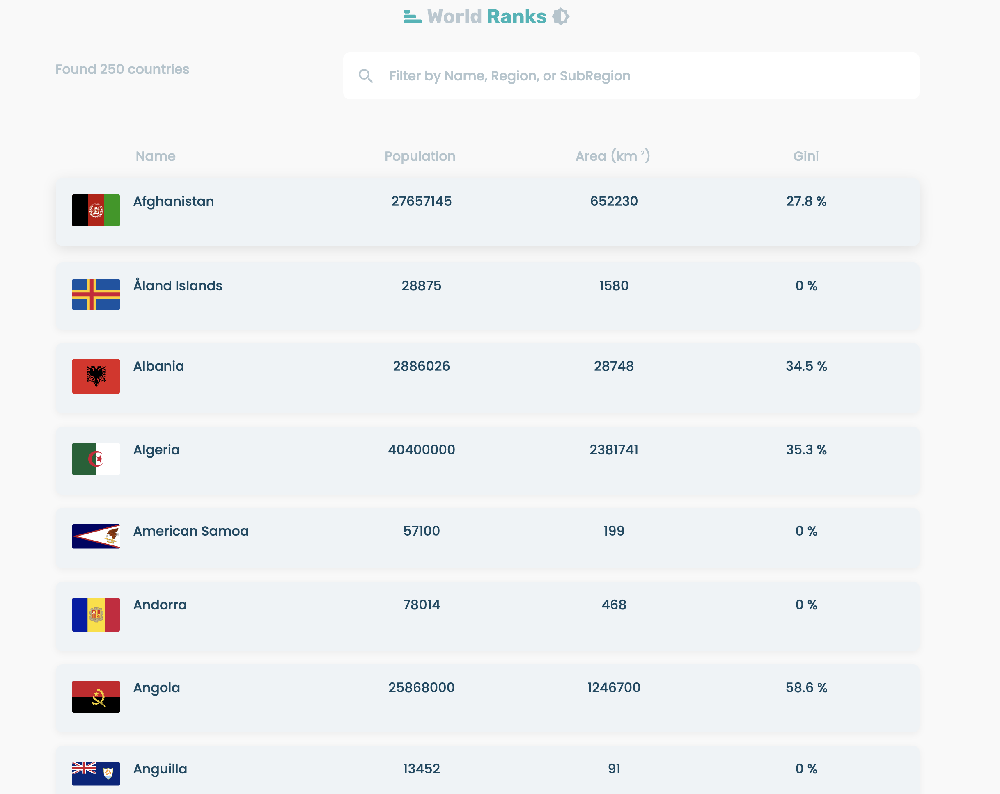
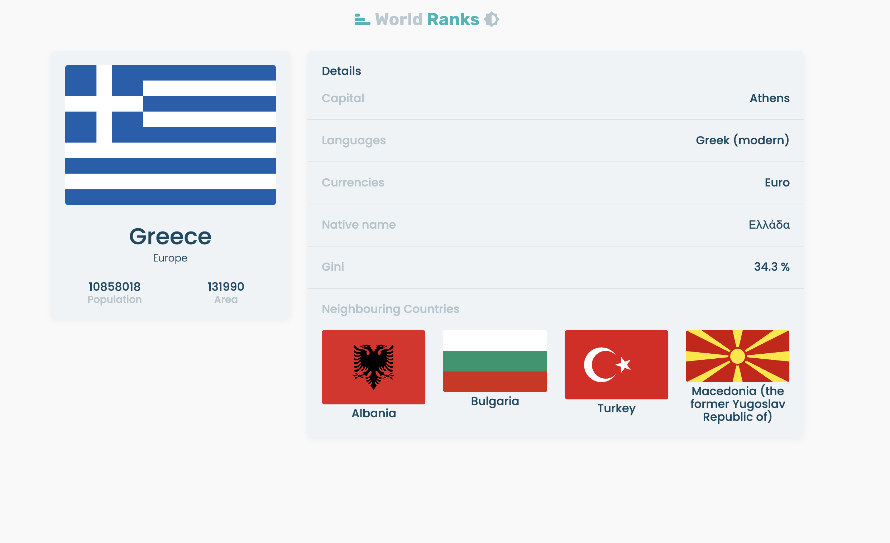

# World Ranks - Next Js

This is a project built with NextJs. In this project, countries details are being fetched from an API. You can see details of the country like its capital, language, currency, neighbouring countries etc. Also, the flag of the country is displayed. It it fully responsive and it is deployed with Vercel. You can find the link below. You can sort the table by name, population, area(km) and gini(measure of statistical dispresion and how happy people are in the country). Lastly, you can use the filter input and choose directly the country of your choice.

# Built With

- NextJs
- Material UI

# Live Version

https://world-ranks-navy.vercel.app/

# AUTHOR

- Github: [@mariosknl](https://github.com/mariosknl)
- Twitter: [@mariosknl](https://twitter.com/MariosKnl)
- Linkedln: [marios-kanellopoulos](https://www.linkedin.com/in/marios-kanellopoulos)
- Portfolio: [marios-kanellopoulos](https://marioskanellopoulos.com/)

# Show your support

Give ⭐️ if you like this project!

# Acknowledgments

- Github: [@nghiemthu](hhttps://github.com/nghiemthu)
- Youtube: [Thu Nghiem](https://www.youtube.com/channel/UCmSmLukBF--YrKZ2g4akYAQ)

### 🤝 Contributing

Contributions, issues, and feature requests are welcome!
Feel free to check the issues page.
